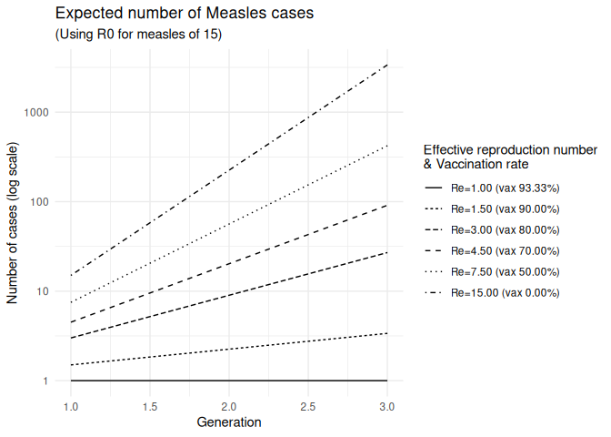

# $\mathcal{R_0}$ of measles
ForeSITE

Measles $\mathcal{R}_0$ is estimated to be between 12 and 18, with a
mean of 15. For our case, we calibrate the model using the mean value of
15. Particularly, in our ABM, we have:

``` math
\begin{align*}
\mathcal{R}_0 & = \mathcal{R}_{0}^{prodromal} + \mathcal{R}_{0}^{rash} \\
& = C p_t \left(\mu_{prodromal} + \mu_{rash}\right) 
\end{align*}
```

Where $C$ is the number of contacts per day, $p_t$ is the probability of
transmission per contact, and $\mu_{prodromal}$ and $\mu_{rash}$ are the
average duration of the prodromal and rash periods, respectively.

To calculate the needed vaccination rate to achieve herd immunity, we
need to lower the transmission rate. To do so, we can reduce $p_t$ by
$(1 - v)$, where $v$ is the proportion of vaccinated individuals. Herd
immunity is achieve when the effective reproduction number
($\mathcal{R}_e$) is less than 1:

``` math
\begin{align*}
\mathcal{R}_e = 1 & > C \times p_t (1 - v) \left(\mu_{prodromal} + \mu_{rash}\right) \\
1 & > \mathcal{R}_0 (1 - v) \\
1 - v & < \frac{1}{\mathcal{R}_0} \\
v & > 1 - \frac{1}{\mathcal{R}_0} \\
\end{align*}
```

An example

``` r
# Expected C for a transmission rate of .90, prodromal period of four
# days, and rash period of three days:
15 / .9 / (4 + 3)
## [1] 2.380952

# Vaccination rate needed to achieve herd immunity
1 - 1 / 15
## [1] 0.9333333

# Re for a community with 88% vaccination rate
(Re <- 15 * (1 - .88))
## [1] 1.8
```

Using the above equations, we can compute the expected number of cases
for different vaccination rates:


