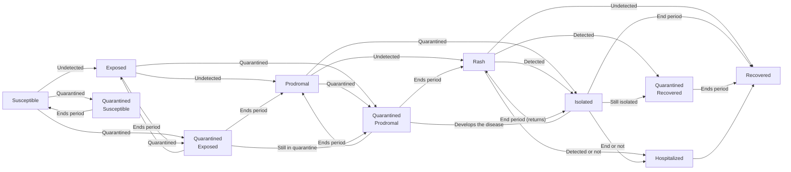
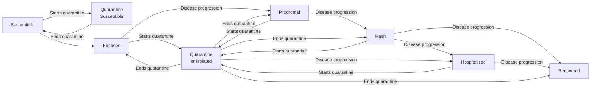
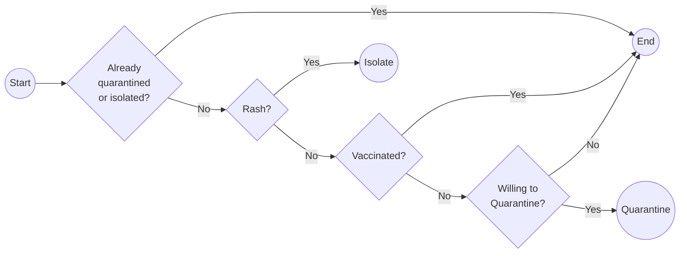

# Implementation details

This model implements a time-discrete Agent-Based Model [ABM] with perfect mixing. The model starts with the introduction of one or more infected individuals. Depending on the vaccination rate, the model simulates the spread of the disease through a population of agents. The model includes a quarantine process that is triggered when an agent is detected in the rash period. The model includes the following parameters:

- **Contact rate**: Contact rate  .
- **Transmission rate**: Transmission rate.
- **Vax efficacy**: Vaccine reduction in susceptibility.
- **Vax improved recovery**: Vaccine reduction in recovery rate.
- **Incubation period**: Incubation period.
- **Prodromal period**: Prodromal period.
- **Rash period**: Rash period.
- **Days undetected**: Days undetected.
- **Hospitalization rate**: Hospitalization rate.
- **Hospitalization days**: Hospitalization duration.
- **Vaccination rate**: Vaccination rate.
- **Quarantine days**: Quarantine days for vaccinated.
- **Quarantine willingness**: Quarantine success rate.

As implemented in the `school_quarantine.cpp` file, the model takes two arguments: (a) A filepath to the model parameters in `yaml` and (b) a filepath to the output directory. The program runs multiple replicates of the model and saves them in the output directory. An example of model parameters in included in the [example_params.yaml](./example_params.yaml) file. 

## States

The model is fairly complex and it includes ten different states:

0. Susceptible
1. Exposed
2. Prodromal
3. Rash
4. Isolated
5. Quarantined Exposed
6. Quarantined Susceptible
7. Quarantined Prodromal
8. Quarantined Recovered
9. Hospitalized
10. Recovered

Throughout the model, agents can either stay in their current state or transition to a new state. The following flowchart shows the overall transition patterns between all states in the model:



A simplified version aggregating quarantine states:



Individual transitions can be viewed in detail in [**03_individual_transitions.md**](./03_individual_transitions.md).


## Quarantine process

The quarantine is executed once throughout the simulation, and it is triggered as soon as an agent is detected in the rash period. Once that occurs, agents' states are updated according to the following process:



## Transition probabilities

In the case of more than one possible transition, the model computes the conditional probability of moving to at most one state, for instance, individuals in the isolation state can either recover, become hospitalizad, or stay isolated, but not be recovered *and* hospitalized. Formally:

```math
P(i\to j | \text{at most one event}) = \frac{
    p_i \times \prod_{k \ne i} (1 - p_k)}{
    \prod_k (1-p_k) + \sum_{k} p_k \times \prod_{l \ne k} (1 - p_l)
    }
```

Where $p_i$ is the unadjusted probability of moving to state $i$. This rationale applies also to cases in which agents may be exposed to more than one infectious peer, so agents can become infected by at most one peer.

## Update susceptibles

Throughout the simulation, the contact rate is held constant, even when agents are isolated. The update schedule of susceptible agents is a function of the "available agents" of the model (excludes isolated, quarantined, or recovered). Thus, the number of contacts susceptible agents make is binomially distributed as follows:

```math
n \sim\text{Binomial}\left(N_{\text{available}}, \frac{C_{rate}}{N_{\text{available}}}\right)
```

<!-- # Notes from walkthrough

- Think about matrix combining states (ij) to simplify model.
~~- Rename vax_reduction_suscept to vax_efficacy.~~
~~- Replace day_detected -> day_flagged.~~
- Assuming that rash is forcefully isolated.
- Prodromal vax may skip quarantine.
~~- Change `quarantine_status` to `system_quarantine_status`.~~
- Change willigness to be fixed at the beginning.
~~- Double check the update_model (what's the order of the events?)?~~
- Add details about sampling from multiple viruses for update susceptible.
- Think about perfect detection, right now, if "Days undetected" == 0, then it's doing nothing.
- ~~Checkout update of rash who recovers but moves to quarantine.~~
~~- Double check the prodromal period move in update_quarantined_prodromal.~~
- Update isolated should also look at the quarantine days. -->