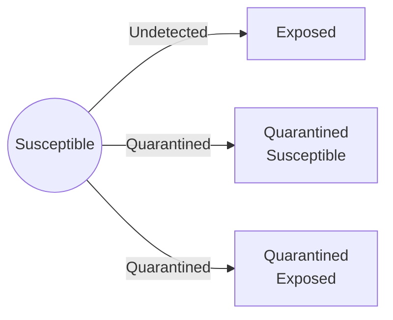
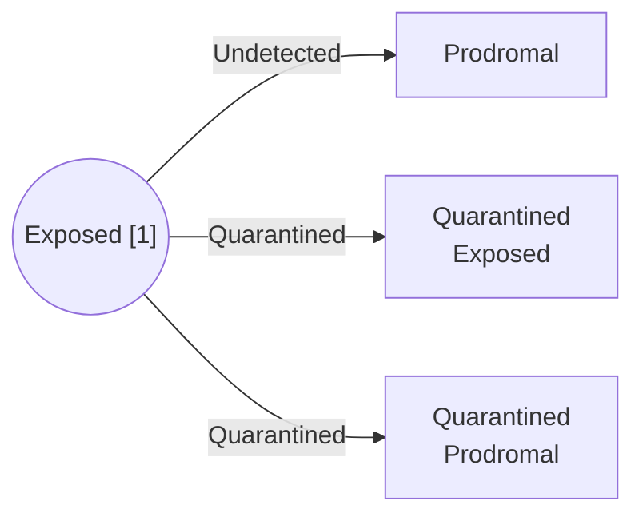
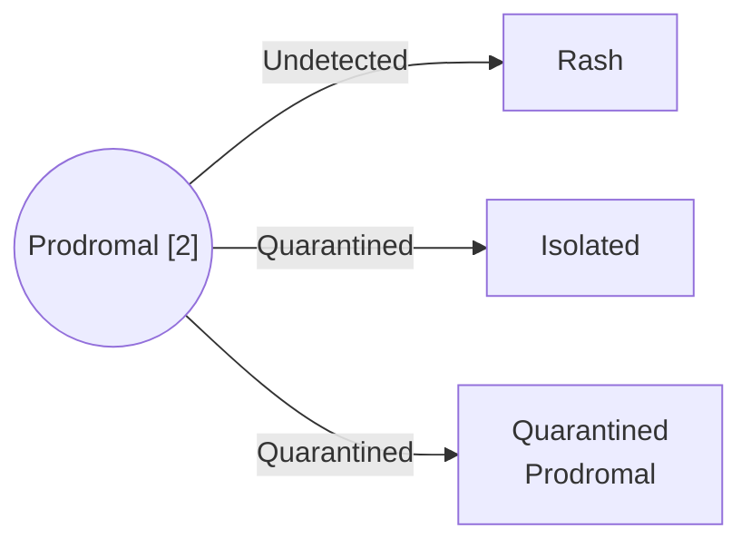
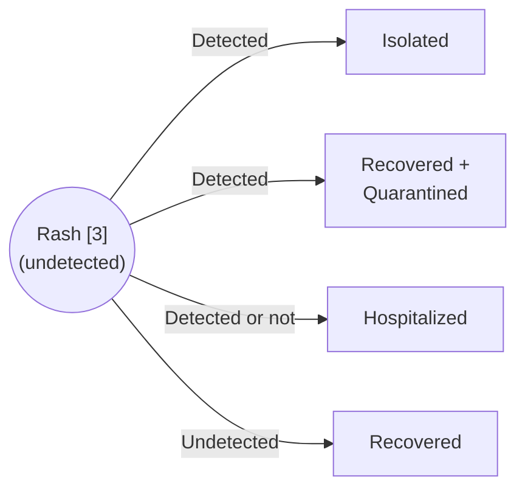
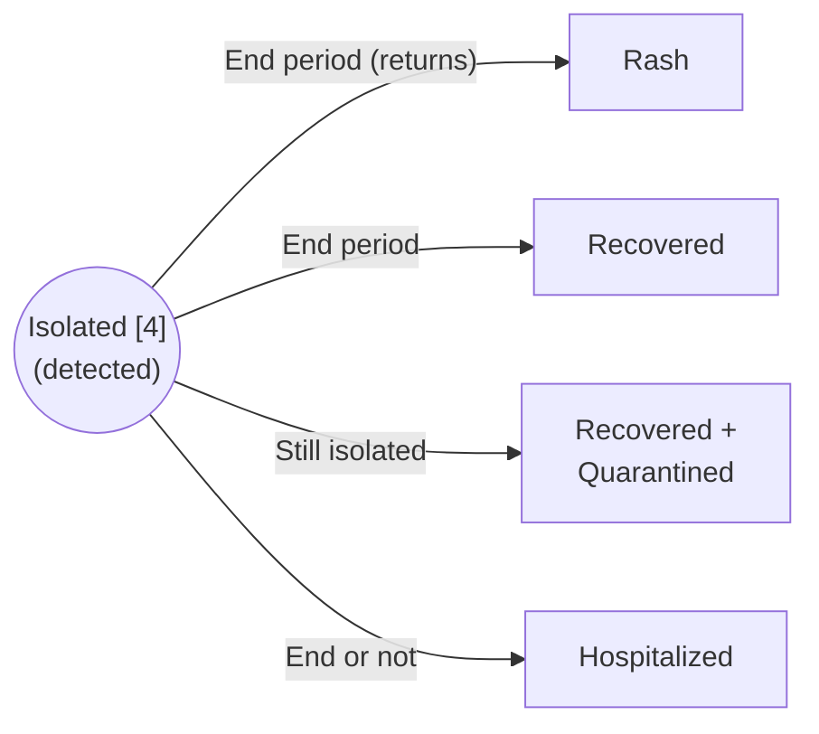
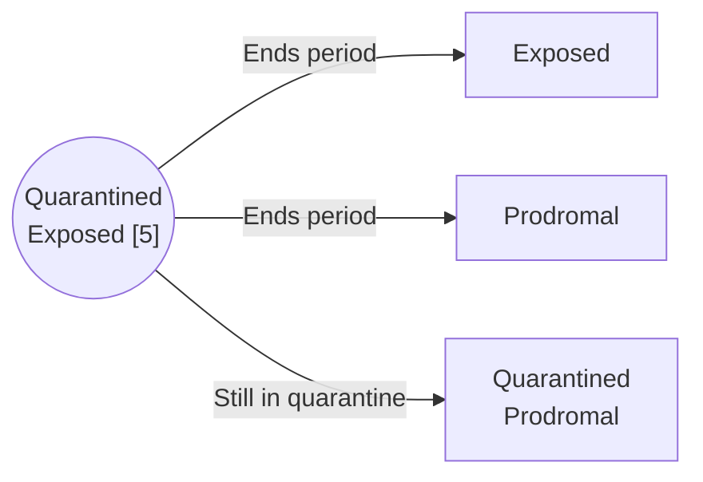
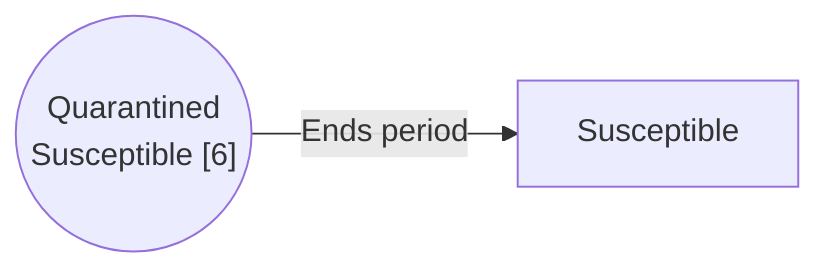
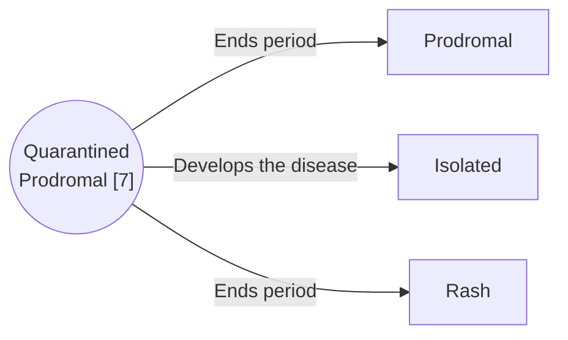
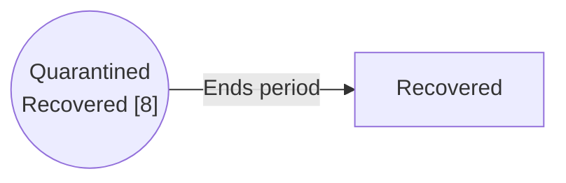
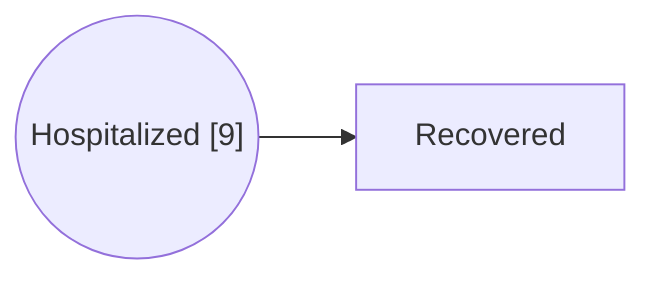

# Possible transitions

The possible transitions are shown in the following diagrams:

```mermaid
flowchart LR
    Susceptible(("Susceptible")) -->|Undetected|Exposed
    Susceptible -->|Quarantined|QuarantinedSusceptible["Quarantined<br>Susceptible"]
    Susceptible -->|Quarantined|QuarantinedExposed["Quarantined<br>Exposed"]
```

```mermaid
flowchart LR
    Exposed(("Exposed [1]")) -->|Undetected|Prodromal
    Exposed -->|Quarantined|QuarantinedExposed["Quarantined<br>Exposed"]
    Exposed -->|Quarantined|QuarantinedProdromal["Quarantined<br>Prodromal"]
```

```mermaid
flowchart LR
    Prodromal(("Prodromal [2]")) -->|Undetected|Rash
    Prodromal -->|Quarantined|Isolated
    Prodromal -->|Quarantined|QuarantinedProdromal["Quarantined<br>Prodromal"]
```

```mermaid
flowchart LR
    Rash(("Rash [3]<br>(undetected)")) -->|Detected|Isolated
    Rash -->|Detected|RecoveredQuarantined["Recovered +<br>Quarantined"]
    Rash -->|Detected or not|Hospitalized
    Rash -->|Undetected|Recovered
```

```mermaid
flowchart LR
    Isolated(("Isolated [4]<br>(detected)")) -->|"End period (returns)"|Rash
    Isolated -->|End period|Recovered
    Isolated -->|Still isolated|RecoveredQuarantined["Recovered +<br>Quarantined"]
    Isolated -->|End or not|Hospitalized
```

```mermaid
flowchart LR
    QuarantineExposed(("Quarantined<br>Exposed [5]")) -->|Ends period|Exposed
    QuarantineExposed -->|Ends period|Prodromal
    QuarantineExposed -->|Still in quarantine|QuarantineProdromal["Quarantined<br>Prodromal"]
```

```mermaid
flowchart LR
    QuarantineSusceptible(("Quarantined<br>Susceptible [6]")) -->|Ends period|Susceptible
```

```mermaid
flowchart LR
    QuarantineProdromal(("Quarantined<br>Prodromal [7]")) -->|Ends period|Prodromal
    QuarantineProdromal-->|Develops the disease|Isolated
    QuarantineProdromal-->|Ends period|Rash
```

```mermaid
flowchart LR
    QuarantineRecovered(("Quarantined<br>Recovered [8]")) -->|Ends period|Recovered
```

```mermaid
flowchart LR
    Hospitalized(("Hospitalized [9]")) -->Recovered
```

