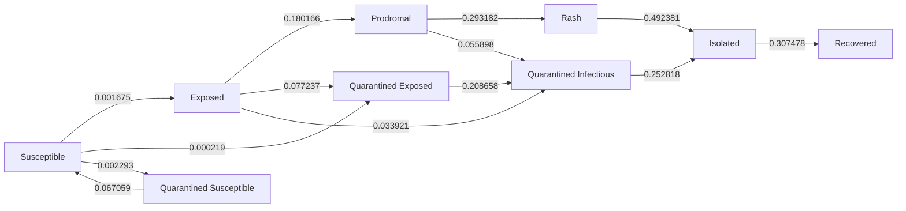
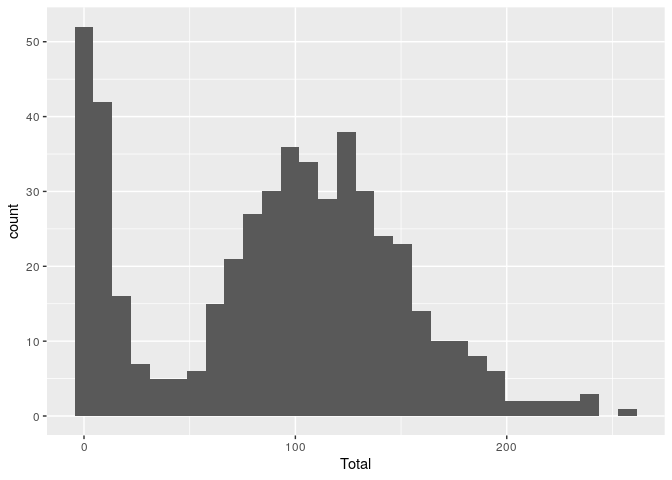
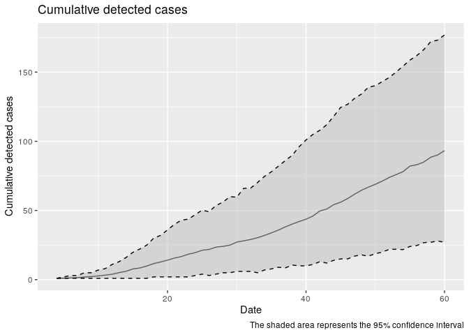

# Measles models


## Highschool model

### Parameters

``` r
yaml::read_yaml("highschool-params.yaml") |>
    str()
```

    Warning in readLines(file, warn = readLines.warn): incomplete final line found
    on 'highschool-params.yaml'

    List of 19
     $ Population size             : int 1000
     $ 1/Rash period               : num 0.25
     $ Contact rate                : num 10
     $ Contact tracing success rate: num 0.9
     $ How many days back to trace : num 14
     $ Incubation period           : num 5
     $ Max days in rash            : num 2
     $ Prodromal period            : num 4
     $ Quarantine days             : num 14
     $ Rash period                 : num 4
     $ Transmission rate           : num 0.95
     $ Vaccination rate            : num 0.9
     $ Vax improved recovery       : num 0.5
     $ Vax reduced suscept.        : num 0.98
     $ initial number of exposed   : num 1
     $ Seed                        : int 2231
     $ N days                      : int 60
     $ Replicates                  : int 1000
     $ Threads                     : int 8

### Run

The following is the output from the highschool model:

    Using file: highschool-params.yaml
    Starting multiple runs (1000) using 8 thread(s)
    _________________________________________________________________________
    _________________________________________________________________________
    ||||||||||||||||||||||||||||||||||||||||||||||||||||||||||||||||||||||||| done.
     done.
    ________________________________________________________________________________
    ________________________________________________________________________________
    SIMULATION STUDY

    Name of the model   : (none)
    Population size     : 1000
    Agents' data        : (none)
    Number of entities  : 0
    Days (duration)     : 60 (of 60)
    Number of viruses   : 1
    Last run elapsed t  : 0.00s
    Total elapsed t     : 5.00s (1000 runs)
    Last run speed      : 1.63 million agents x day / second
    Average run speed   : 10.85 million agents x day / second
    Rewiring            : off

    Global events:
     - Update model (runs daily)

    Virus(es):
     - Measles

    Tool(s):
     - Vaccine

    Model parameters:
     - 1/Rash period                : 0.2500
     - Contact rate                 : 10.0000
     - Contact tracing success rate : 0.9000
     - How many days back to trace  : 14.0000
     - Incubation period            : 5.0000
     - Max days in rash             : 2.0000
     - N days                       : 60.0000
     - Population size              : 1000.0000
     - Prodromal period             : 4.0000
     - Quarantine days              : 14.0000
     - Rash period                  : 4.0000
     - Replicates                   : 1000.0000
     - Seed                         : 2231.0000
     - Threads                      : 8.0000
     - Transmission rate            : 0.9500
     - Vaccination rate             : 0.9000
     - Vax improved recovery        : 0.5000
     - Vax reduced suscept.         : 0.9800
     - initial number of exposed    : 1.0000

    Distribution of the population at time 60:
      - (0) Susceptible             :  999 -> 878
      - (1) Exposed                 :    1 -> 11
      - (2) Prodromal               :    0 -> 8
      - (3) Rash                    :    0 -> 3
      - (4) Isolated                :    0 -> 5
      - (5) Quarantined Exposed     :    0 -> 5
      - (6) Quarantined Susceptible :    0 -> 13
      - (7) Quarantined Infectious  :    0 -> 4
      - (8) Recovered               :    0 -> 73

    Transition Probabilities:
     - Susceptible              1.00  0.00  0.00  0.00  0.00  0.00  0.00  0.00  0.00
     - Exposed                  0.00  0.71  0.18  0.00  0.00  0.08  0.00  0.03  0.00
     - Prodromal                0.00  0.00  0.65  0.29  0.00  0.00  0.00  0.06  0.00
     - Rash                     0.00  0.00  0.00  0.51  0.49  0.00  0.00  0.00  0.00
     - Isolated                 0.00  0.00  0.00  0.00  0.69  0.00  0.00  0.00  0.31
     - Quarantined Exposed      0.00  0.00  0.00  0.00  0.00  0.79  0.00  0.21  0.00
     - Quarantined Susceptible  0.07  0.00  0.00  0.00  0.00  0.00  0.93  0.00  0.00
     - Quarantined Infectious   0.00  0.00  0.00  0.00  0.25  0.00  0.00  0.75  0.00
     - Recovered                0.00  0.00  0.00  0.00  0.00  0.00  0.00  0.00  1.00

    Contact matrix (first 10 entires) (adjacency matrix)
    Each entry is the day of the contact between i and j, 
    with negative values indicating no contact 
    between the individuals.
      -1   -1   -1   -1   19   -1   48   44    3   54 
      -1   -1   -1   -1   43   11   -1   41   48   38 
      -1   -1   -1   -1   27   -1   -1   -1   -1    1 
      -1   -1   -1   -1   46   -1   -1   26   20   -1 
      19   43   27   46   -1   19   37   35   49   33 
      -1   11   -1   -1   19   -1   30   -1   29   51 
      48   -1   -1   -1   37   30   -1   14   56   51 
      44   41   -1   26   35   -1   14   -1   51   41 
       3   48   -1   20   49   29   56   51   -1   40 
      54   38    1   -1   33   51   51   41   40   -1 

This model simulates the spread of measles in a highschool. The
highschool has 1000 students, and the simulation runs for 60 days with
one index case. We can check that transitions between states looking at
the transition matrix:

    Transition Probabilities:
     - Susceptible              1.00  0.00  0.00  0.00  0.00  0.00  0.00  0.00  0.00
     - Exposed                  0.00  0.68  0.19  0.00  0.00  0.11  0.00  0.02  0.00
     - Prodromal                0.00  0.00  0.70  0.26  0.00  0.00  0.00  0.04  0.00
     - Rash                     0.00  0.00  0.00  0.48  0.52  0.00  0.00  0.00  0.00
     - Isolated                 0.00  0.00  0.00  0.00  0.72  0.00  0.00  0.00  0.28
     - Quarantined Exposed      0.00  0.00  0.00  0.00  0.00  0.86  0.00  0.14  0.00
     - Quarantined Susceptible  0.08  0.00  0.00  0.00  0.00  0.00  0.92  0.00  0.00
     - Quarantined Infectious   0.00  0.00  0.05  0.00  0.22  0.00  0.00  0.73  0.00
     - Recovered  

From it, we see:

- Exposed can move to prodromal, quarantined exposed, or quarantined
  infectious.
- Prodromal moves to Rash or Quarantined Prodromal (which is
  infectious).
- Rash moves to Isolated (and triggers contact tracing).
- Isolated moves to Recovered (full immunity).
- Quarantined Exposed either moves to quarantined infectious or to
  isolated. It can moved to exposed, but since the quarantine period is
  14 days, we don’t see any case.
- Quarantined Infectious moves to prodromal (if exits quarantine) or to
  isolated (if rash detected), in which case contact tracing is
  triggered.

Furthermore, we can see the mermaid diagram generated by epiworld:



``` r
library(data.table)
histories <- lapply(list.files(
    "highschool-out", pattern="total_hist", full.names = TRUE),
   \(fn) {
      cbind(fn = fn, data.table::fread(fn))
   }) |> rbindlist()

# Figuring out the outbreak size
exposed <- c("Exposed", "Predromal", "Rash", "Isolated", "Quarantined Exposed", "Quarantined Susceptible", "Recovered")
counts <- histories[(state %in% exposed) & (date == max(date))]
counts <- counts[, .(Total = sum(counts)), by = "fn"]

library(ggplot2)
ggplot(counts, aes(x = Total)) +
    geom_histogram()
```

    `stat_bin()` using `bins = 30`. Pick better value with `binwidth`.



Preparing the data for output

``` r
# Reshape the data to wide
histories_wide <- dcast(
    histories, fn + date ~ state, value.var = "counts")

# Generating simulation ids
histories_wide[, sim_num := as.integer(gsub(".+/([0-9]+)_.+", "\\1", fn))]
histories_wide[, fn := NULL]

fwrite(histories_wide, "highschool-histories.csv")

# Reading the 'transition.csv' files
transitions <- lapply(
    list.files("highschool-out", pattern="transition", full.names = TRUE),
   \(fn) {
      cbind(fn = fn, fread(fn))
    }) |> rbindlist()

# Detected cases
detected <- transitions[
    from != "Isolated" & to == "Isolated",
    .(fn, from, date, counts)
    ]
detected <- detected[counts > 0]
detected[, sim_num := as.integer(gsub(".+/([0-9]+)_.+", "\\1", fn))]
detected[, fn := NULL]

fwrite(detected, "highschool-detected.csv")
```

Some statistics about the contact tracing. Each detected case is moved
to the isolated state and triggers contact tracing. The following plot
shows the cumulative number of detected cases over time:

``` r
detected_cum <- detected[, .(Total = sum(counts)), by = .(date, sim_num )] 
detected_cum[, cumulative := cumsum(Total), by = sim_num]
detected_cum[, min := quantile(cumulative, 0.025), by = date]
detected_cum[, mean := mean(cumulative), by = date]
detected_cum[, max := quantile(cumulative, 0.975), by = date]
detected_cum |> 
    ggplot(aes(x = date, y = cumulative)) +
    geom_line(aes(x=date, y = mean)) +
    geom_ribbon(
        aes(ymin = min, ymax = max), fill = "grey", alpha = 0.5
        ) +
    # Legend about the ribbon and the mean
    geom_line(aes(x=date, y = min), linetype = "dashed") +
    geom_line(aes(x=date, y = max), linetype = "dashed") +
    labs(
        title = "Cumulative detected cases",
        x = "Date",
        y = "Cumulative detected cases",
        caption = "The shaded area represents the 95% confidence interval"
    )
```


