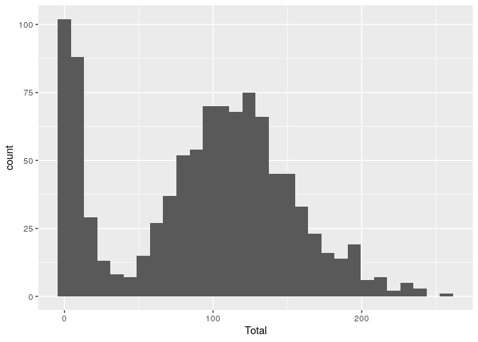

# Measles models

## Highschool model

The highschool model is a discrete-time Agent-Based Model \[ABM\] that
includes the following features:

**Disease progression:** - Susceptible individuals can aquire the virus
from agents in the prodromal or rash state (as long as they are not
isolated or quarantined). - Exposed individuals develop the disease to
transition to the prodromal state. - Prodromal individuals develop the
disease to transition to the rash state. - Rash individuals are
isolated.

**Contact tracing:** - Individuals developing rash trigger contact
tracing. - Contact tracing is not perfect, and some cases may be
missed. - Contacts within the last x days are moved to quarantine. -
Individuals in quarantine who develop the disease trigger contact
tracing as well.

**Vaccination:** - Agents can be vaccinated at the beginning of the
simulation. - Vaccinated agents are less susceptible to the disease. -
Recovered agents are treated as immune.

### Parameters

The following is a raw list of the parameters included in the model:

    Warning in readLines(file, warn = readLines.warn): incomplete final line found
    on 'highschool-params.yaml'

    List of 19
     $ Population size             : int 1000
     $ 1/Rash period               : num 0.25
     $ Contact rate                : num 10
     $ Contact tracing success rate: num 0.9
     $ How many days back to trace : num 14
     $ Incubation period           : num 5
     $ Max days in rash            : num 2
     $ Prodromal period            : num 4
     $ Quarantine days             : num 14
     $ Rash period                 : num 4
     $ Transmission rate           : num 0.95
     $ Vaccination rate            : num 0.9
     $ Vax improved recovery       : num 0.5
     $ Vax reduced suscept.        : num 0.98
     $ initial number of exposed   : num 1
     $ Seed                        : int 2231
     $ N days                      : int 60
     $ Replicates                  : int 1000
     $ Threads                     : int 8

### Run

This model simulates the spread of measles in a highschool. The
highschool has 1000 students, and the simulation runs for 60 days with
one index case. The following is the output from the highschool model:

    Using file: highschool-params.yaml
    Starting multiple runs (1000) using 8 thread(s)
    _________________________________________________________________________
    _________________________________________________________________________
    ||||||||||||||||||||||||||||||||||||||||||||||||||||||||||||||||||||||||| done.
     done.
    ________________________________________________________________________________
    ________________________________________________________________________________
    SIMULATION STUDY

    Name of the model   : (none)
    Population size     : 1000
    Agents' data        : (none)
    Number of entities  : 0
    Days (duration)     : 60 (of 60)
    Number of viruses   : 1
    Last run elapsed t  : 0.00s
    Total elapsed t     : 5.00s (1000 runs)
    Last run speed      : 1.59 million agents x day / second
    Average run speed   : 10.20 million agents x day / second
    Rewiring            : off

    Global events:
     - Update model (runs daily)

    Virus(es):
     - Measles

    Tool(s):
     - Vaccine

    Model parameters:
     - 1/Rash period                : 0.2500
     - Contact rate                 : 10.0000
     - Contact tracing success rate : 0.9000
     - How many days back to trace  : 14.0000
     - Incubation period            : 5.0000
     - Max days in rash             : 2.0000
     - N days                       : 60.0000
     - Population size              : 1000.0000
     - Prodromal period             : 4.0000
     - Quarantine days              : 14.0000
     - Rash period                  : 4.0000
     - Replicates                   : 1000.0000
     - Seed                         : 2231.0000
     - Threads                      : 8.0000
     - Transmission rate            : 0.9500
     - Vaccination rate             : 0.9000
     - Vax improved recovery        : 0.5000
     - Vax reduced suscept.         : 0.9800
     - initial number of exposed    : 1.0000

    Distribution of the population at time 60:
      - (0) Susceptible             :  999 -> 878
      - (1) Exposed                 :    1 -> 11
      - (2) Prodromal               :    0 -> 8
      - (3) Rash                    :    0 -> 3
      - (4) Isolated                :    0 -> 5
      - (5) Quarantined Exposed     :    0 -> 5
      - (6) Quarantined Susceptible :    0 -> 13
      - (7) Quarantined Infectious  :    0 -> 4
      - (8) Recovered               :    0 -> 73

    Transition Probabilities:
     - Susceptible              1.00  0.00  0.00  0.00  0.00  0.00  0.00  0.00  0.00
     - Exposed                  0.00  0.71  0.18  0.00  0.00  0.08  0.00  0.03  0.00
     - Prodromal                0.00  0.00  0.65  0.29  0.00  0.00  0.00  0.06  0.00
     - Rash                     0.00  0.00  0.00  0.51  0.49  0.00  0.00  0.00  0.00
     - Isolated                 0.00  0.00  0.00  0.00  0.69  0.00  0.00  0.00  0.31
     - Quarantined Exposed      0.00  0.00  0.00  0.00  0.00  0.79  0.00  0.21  0.00
     - Quarantined Susceptible  0.07  0.00  0.00  0.00  0.00  0.00  0.93  0.00  0.00
     - Quarantined Infectious   0.00  0.00  0.00  0.00  0.25  0.00  0.00  0.75  0.00
     - Recovered                0.00  0.00  0.00  0.00  0.00  0.00  0.00  0.00  1.00

    Contact matrix (first 10 entires) (adjacency matrix)
    Each entry is the day of the contact between i and j, 
    with negative values indicating no contact 
    between the individuals.
      -1   -1   -1   -1   19   -1   48   44    3   54 
      -1   -1   -1   -1   43   11   -1   41   48   38 
      -1   -1   -1   -1   27   -1   -1   -1   -1    1 
      -1   -1   -1   -1   46   -1   -1   26   20   -1 
      19   43   27   46   -1   19   37   35   49   33 
      -1   11   -1   -1   19   -1   30   -1   29   51 
      48   -1   -1   -1   37   30   -1   14   56   51 
      44   41   -1   26   35   -1   14   -1   51   41 
       3   48   -1   20   49   29   56   51   -1   40 
      54   38    1   -1   33   51   51   41   40   -1 

## Flowchart

This diagram shows the possible transitions between the states in the
model:

## Reading the output

    `stat_bin()` using `bins = 30`. Pick better value with `binwidth`.

Preparing the data for output

Some statistics about the contact tracing. Each detected case is moved
to the isolated state and triggers contact tracing. The following plot
shows the cumulative number of detected cases over time:

