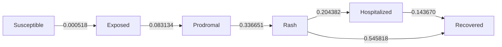
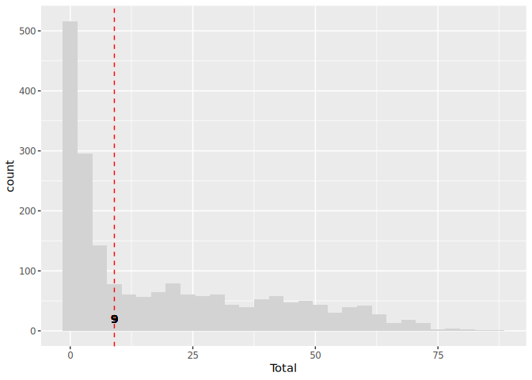
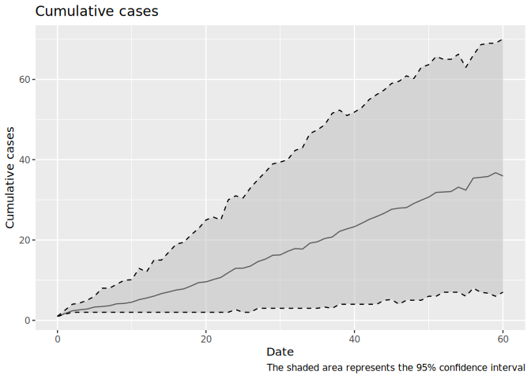
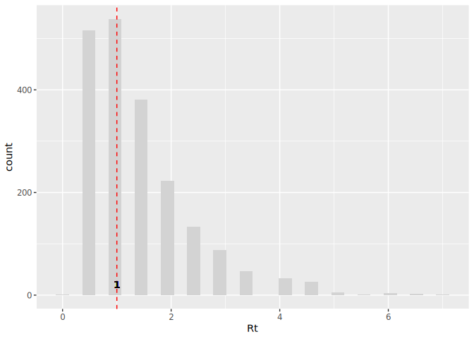

# School quarantine model


## School quarantine model for new_bridge_88

This model is a discrete-time Agent-Based Model \[ABM\] that includes
the following features:

**Disease progression:**

- Susceptible individuals can aquire the virus from agents in the
  prodromal or rash state (as long as they are not isolated or
  quarantined).
- Exposed individuals develop the disease to transition to the prodromal
  state.
- Prodromal individuals develop the disease to transition to the rash
  state.
- Rash individuals are isolated.

**Quarantine process:**

- Individuals developing rash trigger quarantining process.
- Vaccinated individuals are skipped.
- Unvaccinated individuals may reject moving to quarantine.
- Individuals in quarantine who develop the disease trigger contact
  tracing as well.

**Vaccination:**

- Agents can be vaccinated at the beginning of the simulation.
- Vaccinated agents are less susceptible to the disease.
- Recovered agents are treated as immune.

### Parameters

The following is a raw list of the parameters included in the model:

| Parameter | Value | Reference |
|:---|---:|:---|
| Contact rate | 2.38 | Negative binomial. Calibrated using R0=15 as a reference. |
| Incubation period | 12.00 | Geometric + 1. Ref.: Jones and Baranowski (2019) |
| Days undetected | 2.00 | Fixed value. |
| Prodromal period | 3.00 | Geometric + 1. Ref.: Jones and Baranowski (2019) |
| Quarantine days | -1.00 | Utah Measles Disease Plan (“Measles Disease Plan” 2019). |
| Rash period | 4.00 | Geometric + 1. Ref.: “Measles Disease Plan” (2019). |
| Transmission rate | 0.90 | Prob. of transmission fixed. Calibrated using R0=15 as a reference. |
| Vax improved recovery | 0.50 | Fixed value. |
| Vax efficacy | 0.99 | Prob. efficacy fixed. Ref.: Liu et al. (2015). |
| R0 | 15.00 | Theoretical R0. |

Other parameters can be found the corresponding parameters document
[here](params.yaml).

### Run

This model simulates the spread of measles in a highschool. The
highschool has students, and the simulation runs for days with one index
case. The following is the output from the highschool model:

``` r
library(epiworldR)

abm <- with(temp_params, {
  ModelMeaslesQuarantine(
    n = `Population size`,
    prevalence = 1,
    # contact_rate = `Contact rate`,
    transmission_rate = `Transmission rate`,
    incubation_period = `Incubation period`,
    prodromal_period = `Prodromal period`,
    rash_period = `Rash period`,
    days_undetected = `Days undetected`,
    quarantine_period = `Quarantine days`,
    vax_efficacy = `Vax efficacy`,
    vax_improved_recovery = `Vax improved recovery`,
    prop_vaccinated = `Vaccination rate`,
    quarantine_willingness = `Quarantine willingness`,
    isolation_period = `Isolation period`
  )
})


saver <- make_saver("total_hist", "transition", "reproductive", "transition")

set.seed(3312)
run_multiple(
  abm, ndays = temp_params$`N days`,
  nthreads = temp_params$Threads,
  nsims = temp_params$`Replicates`,
  saver = saver
  )
```

    Starting multiple runs (2000) using 10 thread(s)
    _________________________________________________________________________
    _________________________________________________________________________
    ||||||||||||||||||||||||||||||||||||||||||||||||||||||||||||||||||||||||| done.

## Flowchart

This diagram shows the possible transitions between the states in the
model:



## Outbreak size

Estimating the outbreak size:

|   Size | Probability    | Likely size (if \> Size) |
|-------:|:---------------|:-------------------------|
|  2.000 | 0.74           | \[2.00, 72.00\]          |
|  5.000 | 0.59           | \[5.00, 73.00\]          |
| 10.000 | 0.50           | \[10.00, 73.00\]         |
| 20.000 | 0.38           | \[21.00, 75.00\]         |
| 10.000 | Median (50%\>) | \[11.00, 73.00\]         |
| 19.142 | Mean (average) | \[21.00, 75.00\]         |

Likely sizes of the outbreak based on 2000 simulations.



Preparing the data for output

The following figure shows the cummulative number of new cases (detected
or not) over time. Cases can be identified with the following
transitions:

- Susceptible to Exposed.
- Susceptible to Quarantined Exposed.



### Reproductive number of the index case



Althougth the model was calibrated with an R0 of 15, adding vaccination,
a smaller population, and quarantine changes (lowers) the reproductive
number:

    Mean Rt:1.48250874562719

    Median Rt:1

    95% CI Rt:0.5,4

# References

<div id="refs" class="references csl-bib-body hanging-indent"
entry-spacing="0">

<div id="ref-jones2019measles" class="csl-entry">

Jones, Trahern W, and Katherine Baranowski. 2019. “Measles and Mumps:
Old Diseases, New Outbreaks.”

</div>

<div id="ref-liuRoleVaccinationCoverage2015" class="csl-entry">

Liu, Fengchen, Wayne T A Enanoria, Jennifer Zipprich, Seth Blumberg,
Kathleen Harriman, Sarah F Ackley, William D Wheaton, Justine L
Allpress, and Travis C Porco. 2015. “The Role of Vaccination Coverage,
Individual Behaviors, and the Public Health Response in the Control of
Measles Epidemics: An Agent-Based Simulation for California.” *BMC
Public Health* 15 (1): 447. <https://doi.org/10.1186/s12889-015-1766-6>.

</div>

<div id="ref-MeaslesDiseasePlan2019" class="csl-entry">

“Measles Disease Plan.” 2019. Utah Department of Health and Human
Services.
<https://epi.utah.gov/wp-content/uploads/Measles-disease-plan.pdf>.

</div>

</div>
