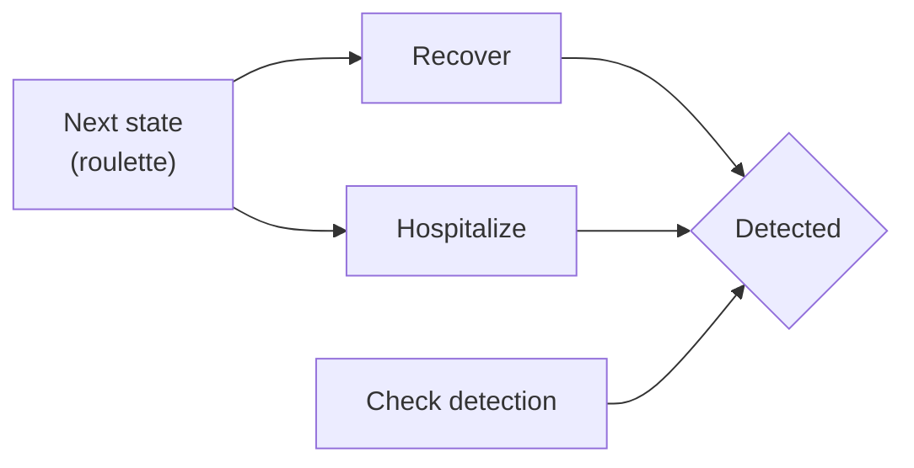

# Models of school quarantine

The different runs here include:

- New Bridge 88: 88% vaccination rate, no NPIs ([link](new_bridge_88.md)).
- New Bridge 88 NPI: 88% vaccination rate, NPIs ([link](new_bridge_88_npi.md)).
- Canyon grove 58: 58% vaccination rate, no NPIs ([link](canyon_grove_58.md)).
- Canyon grove 58 NPI: 58% vaccination rate, NPIs ([link](canyon_grove_58_npi.md)).
- Edgemont 92: 92% vaccination rate, no NPIs ([link](edgemont_92.md)).
- Edgemont 92 NPI: 92% vaccination rate, NPIs ([link](edgemont_92_npi.md)).
- Canyon Crest 74: 74% vaccination rate, no NPIs ([link](canyon_crest_74.md)).
- Canyon Crest 74 NPI: 74% vaccination rate, NPIs ([link](canyon_crest_74_npi.md)).

The NPI runs have quarantine willingness set to 1.0, which means that all individuals will accept quarantine if they develop the disease. Otherwise, there's no quarantine or isolation whatsoever.

All runs were calibrated using an R0 of 15.

# Implementation details

## Rash updates

# Notes from walkthrough

- Think about matrix combining states (ij) to simplify model.
- Rename vax_reduction_suscept to vax_efficacy.
- Replace day_detected -> day_flagged.
- Assuming that rash is forcefully isolated.
- Prodromal vax may skip quarantine.
- Change `quarantine_status` to `system_quarantine_status`.
- Change willigness to be fixed at the beginning.
- Double check the update_model (what's the order of the events?)?
- Add details about sampling from multiple viruses for update susceptible.
- Think about perfect detection, right now, if "Days undetected" == 0, then it's doing nothing.
- ~~Checkout update of rash who recovers but moves to quarantine.~~
- Double check the prodromal period move in update_quarantined_prodromal.
- Update isolated should also look at the quarantine days.