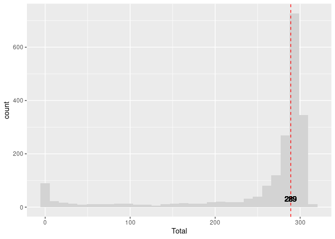
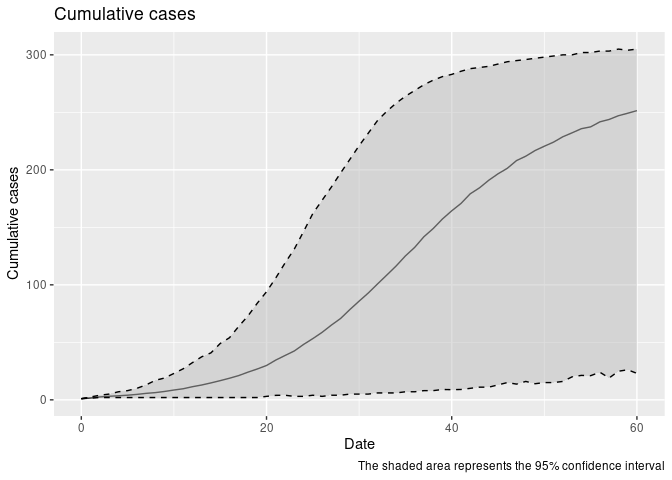
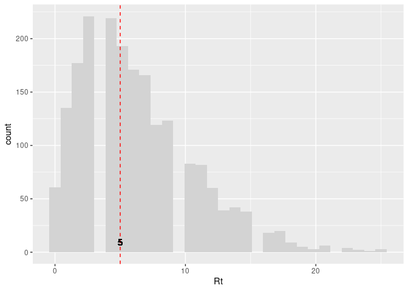

# School quarantine model

## School quarantine model for canyon_grove_58

This model is a discrete-time Agent-Based Model \[ABM\] that includes
the following features:

**Disease progression:**

- Susceptible individuals can aquire the virus from agents in the
  prodromal or rash state (as long as they are not isolated or
  quarantined).
- Exposed individuals develop the disease to transition to the prodromal
  state.
- Prodromal individuals develop the disease to transition to the rash
  state.
- Rash individuals are isolated.

**Quarantine process:**

- Individuals developing rash trigger quarantining process.
- Vaccinated individuals are skipped.
- Unvaccinated individuals may reject moving to quarantine.
- Individuals in quarantine who develop the disease trigger contact
  tracing as well.

**Vaccination:**

- Agents can be vaccinated at the beginning of the simulation.
- Vaccinated agents are less susceptible to the disease.
- Recovered agents are treated as immune.

### Parameters

The following is a raw list of the parameters included in the model:

| Parameter             |   Value | Reference                                                           |
|:----------------------|--------:|:--------------------------------------------------------------------|
| Contact rate          |    2.38 | Negative binomial. Calibrated using R0=15 as a reference.           |
| Incubation period     |   12.00 | Geometric + 1. Ref.: Jones and Baranowski (2019)                    |
| Max days in rash      | 2000.00 | Fixed value.                                                        |
| Prodromal period      |    3.00 | Geometric + 1. Ref.: Jones and Baranowski (2019)                    |
| Quarantine days       |   21.00 | Utah Measles Disease Plan (“Measles Disease Plan” 2019).            |
| Rash period           |    4.00 | Geometric + 1. Ref.: “Measles Disease Plan” (2019).                 |
| Transmission rate     |    0.90 | Prob. of transmission fixed. Calibrated using R0=15 as a reference. |
| Vax improved recovery |    0.50 | Fixed value.                                                        |
| Vax efficacy          |    0.99 | Prob. efficacy fixed. Ref.: Liu et al. (2015).                      |
| R0                    |   15.00 | Theoretical R0.                                                     |

Other parameters can be found the corresponding parameters document
[here](canyon_grove_58_params.yaml).

### Run

This model simulates the spread of measles in a highschool. The
highschool has students, and the simulation runs for days with one index
case. The following is the output from the highschool model:

    Using file: /scratch/local/u6039184/3499126/Rtmp9xMNji/file3492ca3c6a16af.yaml
    Starting multiple runs (2000) using 10 thread(s)
    _________________________________________________________________________
    _________________________________________________________________________
    ||||||||||||||||||||||||||||||||||||||||||||||||||||||||||||||||||||||||| done.
     done.
    ________________________________________________________________________________
    ________________________________________________________________________________
    SIMULATION STUDY

    Name of the model   : (none)
    Population size     : 650
    Agents' data        : (none)
    Number of entities  : 0
    Days (duration)     : 60 (of 60)
    Number of viruses   : 1
    Last run elapsed t  : 0.00s
    Total elapsed t     : 1.00s (2000 runs)
    Last run speed      : 4.34 million agents x day / second
    Average run speed   : 43.09 million agents x day / second
    Rewiring            : off

    Global events:
     - Update model (runs daily)

    Virus(es):
     - Measles

    Tool(s):
     - Vaccine

    Model parameters:
     - 1/Rash period             : 0.2500
     - Contact rate              : 2.3810
     - Incubation period         : 12.0000
     - Max days in rash          : 2000.0000
     - N days                    : 60.0000
     - Population size           : 650.0000
     - Prodromal period          : 3.0000
     - Quarantine days           : 21.0000
     - Quarantine willingness    : 1.0000
     - R0                        : 15.0000
     - Rash period               : 4.0000
     - Replicates                : 2000.0000
     - Seed                      : 2231.0000
     - Threads                   : 10.0000
     - Transmission rate         : 0.9000
     - Vaccination rate          : 0.5800
     - Vax efficacy              : 0.9900
     - Vax improved recovery     : 0.5000
     - initial number of exposed : 1.0000

    Distribution of the population at time 60:
      - (0) Susceptible             : 649 -> 383
      - (1) Exposed                 :   1 -> 100
      - (2) Prodromal               :   0 -> 29
      - (3) Rash                    :   0 -> 36
      - (4) Isolated                :   0 -> 0
      - (5) Quarantined Exposed     :   0 -> 0
      - (6) Quarantined Susceptible :   0 -> 0
      - (7) Quarantined Infectious  :   0 -> 0
      - (8) Recovered               :   0 -> 102

    Transition Probabilities:
     - Susceptible              0.99  0.01  0.00  0.00  0.00  0.00  0.00  0.00  0.00
     - Exposed                  0.00  0.94  0.06  0.00  0.00  0.00  0.00  0.00  0.00
     - Prodromal                0.00  0.00  0.71  0.29  0.00  0.00  0.00  0.00  0.00
     - Rash                     0.00  0.00  0.00  0.78  0.00  0.00  0.00  0.00  0.22
     - Isolated                    -     -     -     -     -     -     -     -     -
     - Quarantined Exposed         -     -     -     -     -     -     -     -     -
     - Quarantined Susceptible     -     -     -     -     -     -     -     -     -
     - Quarantined Infectious      -     -     -     -     -     -     -     -     -
     - Recovered                0.00  0.00  0.00  0.00  0.00  0.00  0.00  0.00  1.00

## Flowchart

This diagram shows the possible transitions between the states in the
model:

``` mermaid
flowchart LR
    s0[Susceptible]
    s1[Exposed]
    s2[Prodromal]
    s3[Rash]
    s4[Isolated]
    s5[Quarantined Exposed]
    s6[Quarantined Susceptible]
    s7[Quarantined Infectious]
    s8[Recovered]
    s0 --&gt;|0.008629| s1
    s1 --&gt;|0.060515| s2
    s2 --&gt;|0.290693| s3
    s3 --&gt;|0.215853| s8

```

## Outbreak size

Estimating the outbreak size:

|     Size | Probability    | Likely size (if \> Size) |
|---------:|:---------------|:-------------------------|
|   2.0000 | 0.97           | \[14.00, 299.00\]        |
|   5.0000 | 0.96           | \[31.00, 299.00\]        |
|  10.0000 | 0.95           | \[43.00, 299.00\]        |
|  20.0000 | 0.94           | \[61.80, 299.00\]        |
| 271.0000 | Median (50%\>) | \[ 272 , 300.275 \]      |
| 236.0415 | Mean (average) | \[ 240 , 300 \]          |

Likely sizes of the outbreak based on 2000 simulations.



Preparing the data for output

Some statistics about the contact tracing. Each detected case is moved
to the isolated state and triggers contact tracing. The following plot
shows the cumulative number of detected cases over time:



### Reproductive number of the index case



    Mean R0:6.3305

    Median R0:5

    95% CI R0:0,17

# References

<div id="refs" class="references csl-bib-body hanging-indent">

<div id="ref-jones2019measles" class="csl-entry">

Jones, Trahern W, and Katherine Baranowski. 2019. “Measles and Mumps:
Old Diseases, New Outbreaks.”

</div>

<div id="ref-liuRoleVaccinationCoverage2015" class="csl-entry">

Liu, Fengchen, Wayne T A Enanoria, Jennifer Zipprich, Seth Blumberg,
Kathleen Harriman, Sarah F Ackley, William D Wheaton, Justine L
Allpress, and Travis C Porco. 2015. “The Role of Vaccination Coverage,
Individual Behaviors, and the Public Health Response in the Control of
Measles Epidemics: An Agent-Based Simulation for California.” *BMC
Public Health* 15 (1): 447. <https://doi.org/10.1186/s12889-015-1766-6>.

</div>

<div id="ref-MeaslesDiseasePlan2019" class="csl-entry">

“Measles Disease Plan.” 2019. Utah Department of Health and Human
Services.
<https://epi.utah.gov/wp-content/uploads/Measles-disease-plan.pdf>.

</div>

</div>
